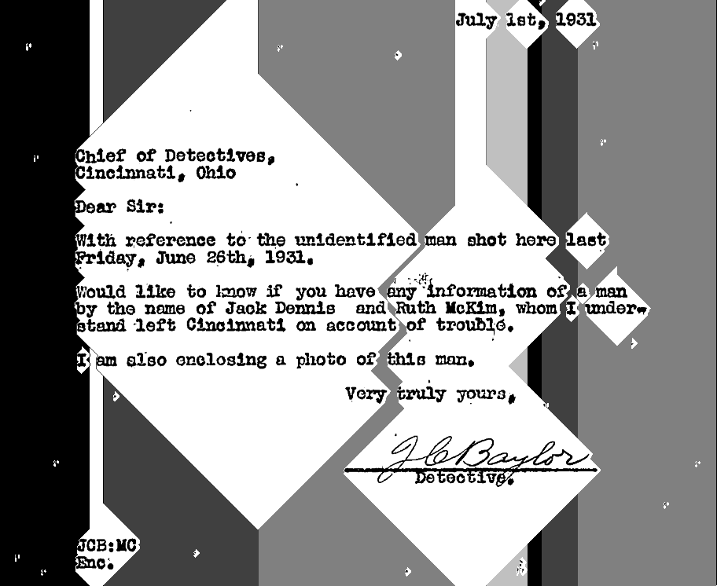
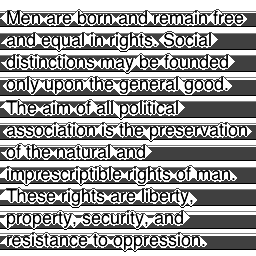

# MastersThesis
This repository represents work towards my masters thesis. Below is the initial outline that I create.

## Research
- Research English/Roman character normalization techniques
- Survey English/Roman font categorization
- Continue researching the Eigen-face technique and verify my implementation
- Research seam carving algorithms
- Continue researching k-Nearest Neighbor
- Determine, mathematically, why cosine similarity is a better metric than Euclidean distance
- Research English character frequencies/probabilities
- Survey spell-checking algorithms

## Training
- Devise better character normalization heuristics (to transform all characters into a 16 by 16 pixel space)
- Generate training images by font category (serif, old style serif, modern serif, slab serif, sans serif, black letter/gothic, typewriter, moveable type)
- Generate training images for 96 printable ASCII characters (and 32 ligatures, as needed)
- Generate mean images for each character in each category
- Use PCA from SVD to generate Eigen-image-space
- Project mean images onto Eigen-image-space to generate weights
- Store eigen-image-space and weights for testing

## Testing
- Use a dynamic programming algorithm for seam carving characters from the text image
- Use improved character normalization heuristics to standardize extracted characters
- Change k-Nearest Neighbor to use k > 1 (now that more than one instance of each character will be available)
- Experiment with incorporating English letter probabilities into the k-NN algorithm
- Experiment with spell checking the recognized text (possibly using Rabin-Karp)
- Experiment with using a dynamic programming algorithm to correct misspelled words

## Results
- A working command line program written in C which will perform fast and reliable OCR
- A 40-60 page thesis paper

# Findings
Here are things that I found during my research which I did not anticipate and forced me to change or improve my approach to the problem.

## Seam Carving
### Skewed Seams
Published example seam carving algorithms tend to create seams which skew toward one direction depending upon the backtracking logic. When 2 or 3 of the possible next pixels are of the same value, which path should be taken? Most example algorithms ignore this and thus skew the seams towards the whatever is in the first conditional. I added code to check which way the seam has been skewing so that in the cases where the pixels are equal I take the path which un-skews the seam.

- This might be making it harder for the algorithm to identify text lines which are rotated slightly, since the algorithm is essentially trying to end at the same y value as it started (when going horizontally).
- It might be better to randomize which path is taken on a tie

### Areas with Information
Just implementing seam carving is not enough; we need to know about the areas of the image which are to be saved, not just the areas to be removed. I had to add heuristics to determine when an area within the image is relevant.

- An interesting area of the image begins when "the absolute value of the last seam's deviation is less than or equal to the seam zero value" and "the absolut value of the current seam's deviation is greater than the seam zero value."
    + The "seam zero value" is the weight of a seam which is assumed to have no weight; our heuristic is 2% of the image width. We use an image relative value instead of zero to eliminate noise (in scanned images this could be speckles on the paper or dust on the scanner)
- An intersting area of the image ends when the current seam's deviation is zero (e.g. the seam goes stright across) or "the absolute value of the last seam's deviation is less than the seam zero value"
- The idea is that flat seams represent areas with no information, information starts when the deviation from zero begins to increase (the seam starts bulging out), and information ends when the deviation begins to decease (the seam starts bulging out less).

In the example below the seam which begins an area of information are colored in light grey, the seams which make up the body of the information are colored in medium grey, and the seam which marks the end of the information are colored black.

### Cross Carving
Sometimes an area of information might carve back up into a previous area of information. At least this would cause unecessary work to be done latter, and at worst it would result in the wrong results being found. I also needed to find a way to carve up documents which may contain blocks of text with different blocks in it; spacing of information in the image could vary a lot. I though a lot about these problems and then it came to me that maybe I should "zoom out" of the image and get on overview of the scene before attempting to split out individual lines of text. When I read I can only read one block of text at once, so it might be good to model the algorithm after how humans (or at least I) work. To zoom out I just shrink the image down (**note** I am writting all of this in C and the non-standard library I am using so far is libpng (it's not worth it to write my own PNG eading and writing library), so I had to write a bilinear image resizing algorithm). The smaller image is also obviously faster to process.

With the resized image I will find interesting areas in the image and then zoom in (actually zoom out less) and perform seam carving again on the area of interest. We will repeat this until we reach our base-case (which I am unsure of a proper heuristic at this point).

### Seam Direction
If a text image has two columns of text, then we do not wan to read straight across the page, we want to read the page in columns. So, we need to determine when to check for vertical seams and when to check for horizontal seams. Presently I am running the seam carving algorithm in both directions and then checking which direction has the lowest total seam weight (if all the seam weightss for each direction are added together which one has the lowest weight), this should be the direction with less jaggedness and thus the direction to split in.

Next, I was considering rotating the seam direction, but it may be best to check the total seam weight for each direction as we zoom into the image.

#### Future Work
In the future we may be interested in processing images besides scanned text, with this approach we can run recognition on each zoom level. For example, when we are zoomed out we may recognize an octogon, and then when we zoom in we recognize the text "STOP", the combination of information from both levels tells us that this is probably a stop sign.
